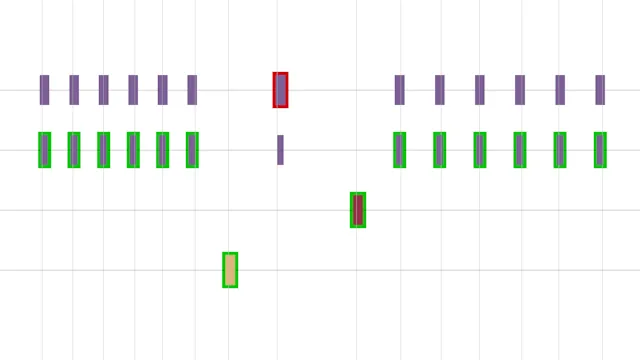

Keyra Illumina
==============

A tiny keystroke visualizer/training tool designed to test your keyboard
abilities on the game _Clair Obscur: Expedition 33_ in particular.

The game relies heavily on reaction mechanics (parry, dodge) and
sometimes drives you mad or makes your fingers hurt. Generally, there
are some things you may come up with during playing:

1. Have I reverse-engineered the enemies' time windows correctly?
1. Am I fast and accurate enough?
1. What the hell, is my keyboard even OK?

Following some Reddit discussions, there seems to be an issue with
locked input, i. e. the game sometimes does not react at all, making you
lose the battle. Let's rule out PEBKAC.

This tool makes you play training rounds and helps analyzing input
delays, in a way similar to _Guitar Hero_.

## Use

Four rows represent the default interactions any keys, from top to bottom,
keyboard or XBox controller:

1. Dodge: Q / B &ndash; if it's light blue, hit twice ( _Danseuse_ timing)
1. Parry: E / RB
1. Gradient parry: W / RT
1. Jump: Space / A

You train pressing the respective button when the ruler moves over some
rectangle on the respective line. There are three difficulties, starting
at _Expeditioner_ mode.

Additionally, you may control the tool (keyboard / XBox controller):

* R / L (M1): Randomize layout
* S / burger button: Restart
* + / arrow up: Increase difficulty
* - / arrow down: Decrease difficulty
* ESC / windows button: Exit

You may want to start the game with `-novsync` to test without
application-enforced VSync.

## Building

You build environment needs:

* CMake
* A modern C++ compiler
* SDL3 development library
